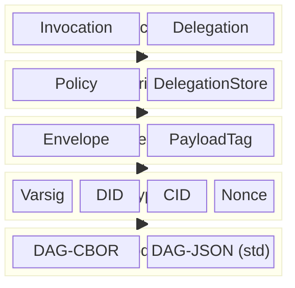
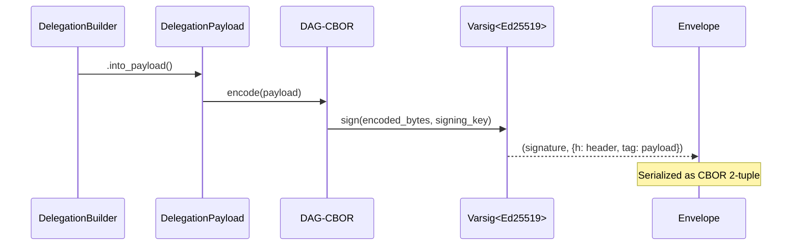
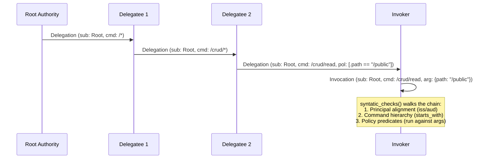

# rs-ucan Design

This directory describes the design and architecture of the rs-ucan implementation of [UCAN v1.0.0-rc.1](https://github.com/ucan-wg/spec).

| Document                         | Purpose                                                 |
|----------------------------------|---------------------------------------------------------|
| [varsig.md](./varsig.md)         | Varsig header, codec layer, and signature abstraction   |
| [envelope.md](./envelope.md)     | Signed envelope format and DAG-CBOR serialization       |
| [delegation.md](./delegation.md) | Delegation payload, subject types, and chain semantics  |
| [policy.md](./policy.md)         | Policy predicate engine and jq-inspired selectors       |
| [invocation.md](./invocation.md) | Invocation payload, promise types, and chain validation |
| [did.md](./did.md)               | DID abstraction and `did:key` (Ed25519) implementation  |
| [no_std.md](./no_std.md)         | `no_std` strategy, feature gates, and platform support  |

## Architecture



## Crate Structure

```
rs-ucan/
  varsig/       Signature metadata layer (no_std)
  ucan/         Core UCAN implementation (no_std)
  ucan_wasm/    Wasm bindings (stub)
```

The dependency direction is:

```
ucan_wasm → ucan → varsig
```

## Data Flow



## Delegation Chain



## Spec Version

This implementation targets:

| Spec                                                     | Version     |
|----------------------------------------------------------|-------------|
| [UCAN](https://github.com/ucan-wg/spec)                  | v1.0.0-rc.1 |
| [UCAN Delegation](https://github.com/ucan-wg/delegation) | v1.0.0-rc.1 |
| [Varsig](https://github.com/ChainAgnostic/varsig)        | Draft       |

## Design Principles

- _`no_std` first_ — both crates compile without `std` (`alloc` only)
- _Type-driven_ — builders enforce required fields at compile time via phantom types
- _Parse, don't validate_ — `Command::parse()`, `Timestamp::from_unix()`, `DID::from_str()` return structured types that make invalid states unrepresentable
- _Codec agnostic_ — the `Codec<T>` trait abstracts over DAG-CBOR/DAG-JSON; signature verification works against any codec
- _Algorithm agnostic_ — the `Verify`/`Sign` traits abstract over Ed25519, ECDSA (P-256/P-384/P-521), and WebCrypto composites
- _Content addressed_ — delegations and invocations are identified by their CID (CIDv1, SHA-256, DAG-CBOR)
