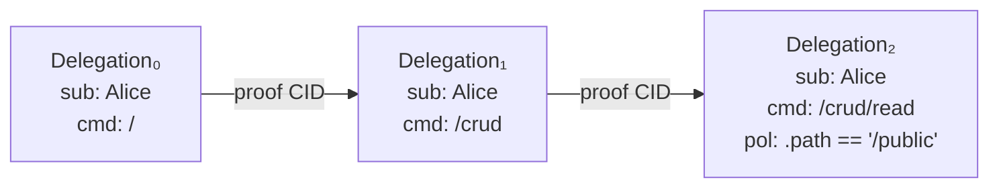

# Delegation

A delegation is a signed capability token that grants an audience the authority to act on behalf of a subject, scoped by command and policy.

## Overview

A UCAN delegation encodes _who_ is granting authority (`iss`), _to whom_ (`aud`), _over what resource_ (`sub`), _for which actions_ (`cmd`), and _under what constraints_ (`pol`). The issuer signs the payload with their key; the result is wrapped in an [`Envelope`](./envelope.md) and content-addressed by its CID.

Delegations form chains: each link narrows the scope of the one before it. A chain is valid when every link's `aud` matches the next link's `iss`, every `sub` is coherent, and every `cmd` is equal to or more specific than its parent.

```
┌──────────────────────────────────────────────────────┐
│ Envelope                                             │
│  ┌─────────┐  ┌──────────────────────────────────┐   │
│  │   sig   │  │ DelegationPayload                │   │
│  │ (bytes) │  │  iss, aud, sub, cmd, pol,        │   │
│  │         │  │  exp, nbf, meta, nonce           │   │
│  └─────────┘  └──────────────────────────────────┘   │
│               ┌──────────────────────────────────┐   │
│               │ Varsig header (tag "dlg/1.0.0…") │   │
│               └──────────────────────────────────┘   │
└──────────────────────────────────────────────────────┘
```

## Payload Fields

| Field | CBOR Key | Type | Required | Description |
|-------|----------|------|----------|-------------|
| Issuer | `iss` | `D: Did` | yes | DID of the signer granting authority |
| Audience | `aud` | `D: Did` | yes | DID of the recipient receiving authority |
| Subject | `sub` | `DelegatedSubject<D>` | yes | Resource being delegated (DID or `null`) |
| Command | `cmd` | `Command` | yes | Slash-delimited action scope |
| Policy | `pol` | `Vec<Predicate>` | yes | Constraint predicates over invocation args |
| Expiration | `exp` | `Option<Timestamp>` | no | Optional expiry (UNIX seconds) |
| Not Before | `nbf` | `Option<Timestamp>` | no | Optional activation time (UNIX seconds) |
| Metadata | `meta` | `BTreeMap<String, Ipld>` | no | Arbitrary key-value metadata (defaults to `{}`) |
| Nonce | `nonce` | `Nonce` | yes | Unique bytes to prevent replay |

> [!NOTE]
> The envelope tag is `"dlg"` at version `"1.0.0-rc.1"`. This pair is emitted by the `PayloadTag` impl and used by deserializers to distinguish delegations from invocations.

## `DelegatedSubject`

The subject determines _whose_ resource is being delegated.

```rust
enum DelegatedSubject<D: Did> {
    Specific(D),
    Any,
}
```

| Variant | Meaning | CBOR Encoding |
|---------|---------|---------------|
| `Specific(did)` | The named DID owns the resource | DID string |
| `Any` | Wildcard — delegates authority over _any_ subject | `null` (0xF6) |

`Any` is the _powerline_ pattern: a node in the authorization graph that proxies capability for any subject. It is intentionally powerful and should be used sparingly.

### Coherence

Two subjects are _coherent_ when they could appear in the same chain:

```rust
impl<D: Did> DelegatedSubject<D> {
    fn coherent(&self, other: &Self) -> bool {
        match (self, other) {
            (Any, _) | (_, Any) => true,
            (Specific(a), Specific(b)) => a == b,
        }
    }
}
```

`allows` is the directional check: `Specific(did)` allows only that DID; `Any` allows everything.

## Command

A `Command` is a `/`-delimited, lowercase path that scopes which actions are permitted.

### Validation Rules

| Rule | Example Valid | Example Invalid |
|------|--------------|-----------------|
| Must start with `/` | `/crud` | `crud` |
| Must be lowercase | `/msg/send` | `/Msg/Send` |
| No trailing slash (except root) | `/crud/create` | `/crud/create/` |
| No empty segments | `/crud/create` | `/crud//create` |

The root command `/` represents _all_ commands. It serializes as the string `"/"` and stores an empty segment vector internally.

### Hierarchy Matching

`Command::starts_with` checks whether one command is a prefix of another at the segment level. This is the mechanism for narrowing scope across a delegation chain.

```rust
let parent = Command::parse("/crypto")?;
let child  = Command::parse("/crypto/sign")?;
let other  = Command::parse("/cryptocurrency")?;

assert!(child.starts_with(&parent));   // true — /crypto/sign ⊂ /crypto
assert!(!other.starts_with(&parent));  // false — segment mismatch
```

> [!NOTE]
> Matching is per-segment, not per-character. `/crypto` does _not_ match `/cryptocurrency`.

## Builder

`DelegationBuilder` uses phantom-typed generics and sealed traits to enforce required fields at compile time.

```mermaid
stateDiagram-v2
    [*] --> Unset4: DelegationBuilder::new()
    Unset4 --> HasIss: .issuer(signer)
    HasIss --> HasIssAud: .audience(did)
    HasIssAud --> HasIssAudSub: .subject(sub)
    HasIssAudSub --> Complete: .command(segs)
    Complete --> Delegation: .try_build()
    Complete --> DelegationPayload: .into_payload()

    state Unset4 {
        [*]: Iss=Unset, Aud=Unset, Sub=Unset, Cmd=Unset
    }
    state Complete {
        [*]: Iss=DidSigner, Aud=Did, Sub=DelegatedSubject, Cmd=Command
    }
```

The type signature evolves as fields are set:

```rust
struct DelegationBuilder<
    D:   DidSignerOrUnset,
    Aud: DidOrUnset,
    Sub: DelegatedSubjectOrUnset,
    Cmd: CommandOrUnset,
> { /* ... */ }
```

Each setter method returns a _new_ builder with one `Unset` slot replaced by its concrete type. `try_build` and `into_payload` are only available on the fully-concrete impl:

```rust
impl<D: DidSigner>
    DelegationBuilder<D, D::Did, DelegatedSubject<D::Did>, Command>
{
    fn try_build(self) -> Result<Delegation<D::Did>, SignerError<..>> { .. }
    fn into_payload(self) -> DelegationPayload<D::Did> { .. }
}
```

The sealed traits (`DidSignerOrUnset`, `DidOrUnset`, `DelegatedSubjectOrUnset`, `CommandOrUnset`) live in `sealed.rs`. They are implemented for `Unset` and for the concrete type, ensuring no third-party types can satisfy the bounds.

Optional fields (`policy`, `expiration`, `not_before`, `meta`, `nonce`) can be set in any order and do not affect the type parameters.

## `DelegationStore`

The `DelegationStore` trait provides CID-keyed storage and retrieval of delegations. It is generic over a `FutureForm` parameter that controls whether the returned futures are `Send`.

```rust
trait DelegationStore<K: FutureForm, D: Did, T: Borrow<Delegation<D>>> {
    type InsertError: Error;
    type GetError: Error;

    fn get_all(&self, cids: &[Cid]) -> K::Future<'_, Result<Vec<T>, Self::GetError>>;
    fn insert_by_cid(&self, cid: Cid, delegation: T) -> K::Future<'_, Result<(), Self::InsertError>>;
}
```

The free function `store::insert` computes the CID and delegates to `insert_by_cid`:

```rust
async fn insert<K, D, T, S: DelegationStore<K, D, T>>(
    store: &S,
    delegation: T,
) -> Result<Cid, S::InsertError>;
```

### Built-in Implementations

| Backing Type | Feature | `FutureForm` | Ownership | Error Types |
|-------------|---------|-------------|-----------|-------------|
| `Rc<RefCell<BTreeMap<Cid, Rc<Delegation<D>>>>>` | `no_std` | `Local` | `Rc` | `Infallible` / `Missing` |
| `Rc<RefCell<HashMap<Cid, Rc<Delegation<D>>, H>>>` | `std` | `Local` | `Rc` | `Infallible` / `Missing` |
| `Arc<Mutex<HashMap<Cid, Arc<Delegation<D>>, H>>>` | `std` | `Local` _or_ `Sendable` | `Arc` | `StorePoisoned` / `LockedStoreGetError` |

The `Arc<Mutex<HashMap>>` impl uses the `#[future_form]` attribute macro to generate both `Local` and `Sendable` variants. The `Sendable` variant requires `D: Send + Sync` and related bounds.

## Nonce

Every delegation carries a `Nonce` to prevent replay and ensure CID uniqueness.

```rust
enum Nonce {
    Nonce16([u8; 16]),
    Custom(Vec<u8>),
}
```

| Constructor | Feature | Description |
|------------|---------|-------------|
| `Nonce::from_bytes(&[u8])` | always | Promotes 16-byte slices to `Nonce16`, otherwise `Custom` |
| `Nonce::generate_16()` | `getrandom` | Fills 16 bytes from the platform CSPRNG |

The builder auto-generates a nonce via `generate_16` when the `getrandom` feature is active. Without that feature, callers must supply a nonce explicitly or the builder panics.

Nonces serialize as CBOR byte strings via a `serde_bytes::ByteBuf` wrapper.

## Chain Semantics

Delegations form a directed chain from a root authority to a final invoker. Each link references its proof delegations by CID.



Validation walks the chain and checks three properties at each link:

| Check | Rule |
|-------|------|
| Principal alignment | `delegation[n].aud == delegation[n+1].iss` |
| Subject coherence | `delegation[n].sub.coherent(delegation[n+1].sub)` |
| Command hierarchy | `delegation[n+1].cmd.starts_with(delegation[n].cmd)` |

Each successive delegation may _narrow_ scope (more specific command, tighter policy) but never _widen_ it. The root delegation establishes the ceiling of authority; every downstream link fits within it.
