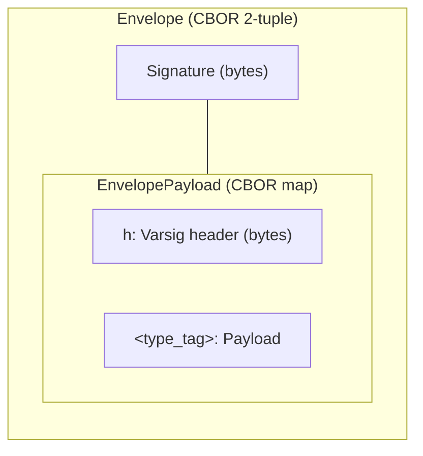
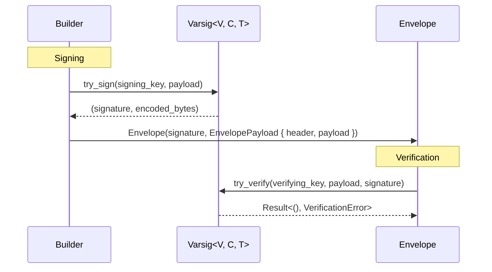

# Envelope

The Envelope is a signed, self-describing container that pairs a cryptographic signature with a Varsig header and a tagged payload, serialized as a CBOR 2-tuple.

## Overview

Every UCAN (delegation or invocation) is wrapped in an `Envelope` before it goes on the wire. The envelope binds a signature to the payload it covers and carries enough metadata (via the Varsig header) for any receiver to verify the signature without prior configuration.



The outer structure is a _sequence_ (positional). The inner structure is a _map_ (keyed). This split keeps the signature at a stable index while allowing the payload map to evolve with new type tags.

## Type Structure

```rust
struct Envelope<V: Verify<Signature = S>, T, S: SignatureEncoding>(
    S,                       // signature
    EnvelopePayload<V, T>,   // header + payload
);

struct EnvelopePayload<V: Verify, T> {
    header:  Varsig<V, DagCborCodec, T>,  // signing metadata
    payload: T,                           // e.g., DelegationPayload
}
```

| Field | Type | Role |
|-------|------|------|
| `Envelope.0` | `S: SignatureEncoding` | Raw signature bytes |
| `Envelope.1` | `EnvelopePayload<V, T>` | Inner map with header and payload |
| `EnvelopePayload.header` | `Varsig<V, DagCborCodec, T>` | Algorithm + codec metadata |
| `EnvelopePayload.payload` | `T` | Domain-specific payload (delegation, invocation) |

## PayloadTag

The `PayloadTag` trait associates each payload type with a versioned type tag used as the map key in the serialized envelope.

```rust
trait PayloadTag {
    fn spec_id() -> &'static str;
    fn version() -> &'static str;
    fn tag() -> String {
        format!("ucan/{}@{}", Self::spec_id(), Self::version())
    }
}
```

| Payload | `spec_id()` | `tag()` |
|---------|-------------|---------|
| `DelegationPayload` | `"dlg"` | `"ucan/dlg@1.0.0-rc.1"` |
| `InvocationPayload` | `"inv"` | `"ucan/inv@1.0.0-rc.1"` |

The tag doubles as a _version discriminator_: a deserializer encountering an unrecognized tag can reject the payload before attempting to parse it.

## Wire Format

A serialized envelope is a DAG-CBOR 2-tuple. The outer layer is a fixed-length CBOR array, and the inner layer is a fixed-length CBOR map with two entries.

```
CBOR 2-tuple (array, length 2)
├─ [0] Signature ─────── CBOR bytes (major type 2)
└─ [1] Payload map ───── CBOR map  (major type 5, length 2)
       ├─ "h" ────────── CBOR bytes (Varsig header)
       └─ <type_tag> ─── CBOR map   (domain payload)
            e.g. "ucan/dlg@1.0.0-rc.1"
```

Expanded byte-level view for an Ed25519 delegation:

```
82                          -- array(2)
│
├─ 58 40 <64 sig bytes>    -- bytes(64): Ed25519 signature
│
└─ A2                      -- map(2)
   │
   ├─ 61 68                -- text(1): "h"
   │  58 08 <varsig bytes> -- bytes(8): 0x34 0x01 0xED 0x01 ...
   │
   └─ 76 7563616E2F...     -- text(22): "ucan/dlg@1.0.0-rc.1"
      A9 ...               -- map(9): DelegationPayload fields
```

> [!NOTE]
> The Varsig header is serialized as raw CBOR bytes, _not_ as a nested structure. This matches the Varsig specification and keeps the header opaque to generic CBOR tooling.

## Serialization

Serialization uses hand-written `Serialize` impls rather than derive macros to enforce the 2-tuple layout.

### Envelope (outer)

```rust
// Simplified from envelope.rs:36-43
fn serialize(&self, serializer: Ser) -> Result<Ser::Ok, Ser::Error> {
    let mut seq = serializer.serialize_tuple(2)?;
    seq.serialize_element(serde_bytes::Bytes::new(self.0.to_bytes()))?;
    seq.serialize_element(&self.1)?;
    seq.end()
}
```

The signature is wrapped in `serde_bytes::Bytes` to force CBOR major type 2 (bytes) rather than major type 4 (array of integers).

### EnvelopePayload (inner)

```rust
// Simplified from envelope.rs:119-126
fn serialize(&self, serializer: S) -> Result<S::Ok, S::Error> {
    let mut map = serializer.serialize_map(Some(2))?;
    map.serialize_entry("h", &self.header)?;
    map.serialize_entry(&T::tag(), &self.payload)?;
    map.end()
}
```

The map key for the payload comes from `PayloadTag::tag()`, making the serialized form self-describing.

## Deserialization

Deserialization uses custom `Visitor` implementations at both levels.

### Envelope Visitor

The outer visitor expects a 2-element sequence:

1. Deserialize the first element as `Ipld::Bytes` to extract the raw signature.
2. Convert the byte slice into `S` via `SignatureEncoding::try_from`.
3. Deserialize the second element as `EnvelopePayload<V, T>`.

```rust
// Simplified from envelope.rs:74-94
fn visit_seq(self, mut seq: A) -> Result<Envelope<V, T, S>, A::Error> {
    let Ipld::Bytes(sig_bytes) = seq.next_element::<Ipld>()? else {
        return Err(Error::custom("expected bytes"));
    };
    let signature = S::try_from(sig_bytes.as_slice())?;
    let payload: EnvelopePayload<V, T> = seq.next_element()?;
    Ok(Envelope(signature, payload))
}
```

> [!NOTE]
> The signature is deserialized through `Ipld::Bytes` rather than directly as `S` because CBOR bytes arrive as an opaque blob. Routing through IPLD lets the CBOR deserializer handle major-type dispatch before the signature type attempts conversion.

### EnvelopePayload Visitor

The inner visitor expects a map with exactly two keys:

1. `"h"` — deserialized as `Ipld::Bytes`, then re-deserialized through a `BytesDeserializer` into `Varsig<V, DagCborCodec, T>`.
2. _Any other key_ — treated as the payload and deserialized as `T`.

```rust
// Simplified from envelope.rs:153-192
fn visit_map(self, mut map: M) -> Result<EnvelopePayload<V, T>, M::Error> {
    while let Some(key) = map.next_key::<&str>()? {
        if key == "h" {
            let Ipld::Bytes(bytes) = map.next_value::<Ipld>()?;
            let de = BytesDeserializer::new(&bytes);
            header = Some(Varsig::deserialize(de)?);
        } else {
            payload = Some(map.next_value::<T>()?);
        }
    }
    Ok(EnvelopePayload { header, payload })
}
```

The two-pass deserialization of the Varsig header (CBOR → `Ipld::Bytes` → `BytesDeserializer` → `Varsig`) is necessary because the header is stored as an opaque byte string in the CBOR map. The `BytesDeserializer` re-enters the serde pipeline so that `Varsig`'s own `Deserialize` impl can parse the LEB128-encoded multicodec tags.

## Connection to Varsig

The Envelope delegates all cryptographic work to the Varsig layer. Signing and verification happen _outside_ the Envelope — the builder calls `Varsig::try_sign` to produce the signature, then wraps the result.



The Envelope itself is a _transport wrapper_. It does not interpret the signature or the Varsig header — it only ensures they survive serialization roundtrips intact.

## Design Decisions

| Decision | Rationale |
|----------|-----------|
| Tuple for outer, map for inner | Signature position is fixed (no key ambiguity); payload map is extensible |
| `serde_bytes::Bytes` for signature | Forces CBOR bytes encoding; avoids accidental array-of-ints serialization |
| `Ipld::Bytes` on deserialization | Delegates CBOR major-type dispatch to the IPLD layer |
| `BytesDeserializer` for Varsig header | Re-enters serde pipeline so `Varsig::deserialize` can parse LEB128 tags from raw bytes |
| `PayloadTag` as a trait | Type tag is derived from the payload type at compile time, not stored as a field |
| Hand-written `Serialize`/`Deserialize` | Derive macros cannot express the tuple-outside-map-inside layout |
