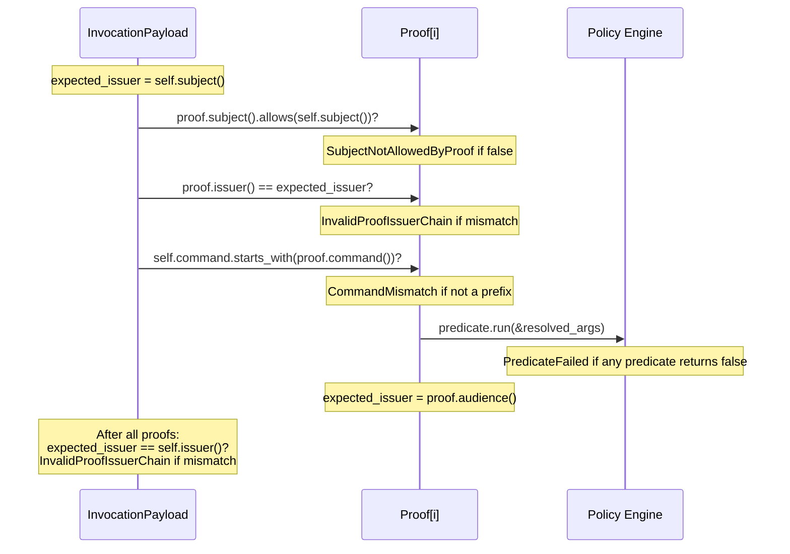

# Invocation

An invocation exercises a delegated capability, commanding a receiver to perform an action on a subject's behalf.

## Overview

An `Invocation<D>` wraps an `InvocationPayload<D>` inside a signed `Envelope`. The payload names the subject resource, the command to run, and the arguments to pass. It references one or more `Delegation` tokens by CID in its `prf` field. Validators walk those proofs to confirm that the invoker has been granted sufficient authority.

```
┌──────────────────────────────────────────────┐
│ Envelope                                     │
│  ┌─────────┐  ┌───────────────────────────┐  │
│  │  Varsig  │  │  InvocationPayload        │  │
│  │  header  │  │   iss, aud, sub, cmd, arg │  │
│  │  + sig   │  │   prf → [Cid; N]         │  │
│  └─────────┘  └───────────────────────────┘  │
└──────────────────────────────────────────────┘
```

The `prf` CIDs form an _ordered chain_. The first proof's issuer must be the subject. Each subsequent proof's issuer must equal the previous proof's audience. The final proof's audience must equal the invocation's issuer.

> [!NOTE]
> The payload tag is `"inv"` with version `"1.0.0-rc.1"`, matching the `PayloadTag` impl. This tag appears in the Varsig envelope header and identifies the payload kind to decoders.

## Payload Fields

| Field | Serde Key | Type | Required | Description |
|-------|-----------|------|----------|-------------|
| `issuer` | `iss` | `D` (DID) | yes | The principal invoking the capability |
| `audience` | `aud` | `D` (DID) | yes | The executor expected to run the command |
| `subject` | `sub` | `D` (DID) | yes | The resource being acted upon |
| `command` | `cmd` | `Command` | yes | Slash-delimited capability path (e.g. `/crud/read`) |
| `arguments` | `arg` | `BTreeMap<String, Promised>` | yes | Arguments to the command; values may be promises |
| `proofs` | `prf` | `Vec<Cid>` | yes | Ordered CIDs of backing delegations |
| `cause` | `cause` | `Option<Cid>` | no | CID of a prior invocation that triggered this one |
| `issued_at` | `iat` | `Option<Timestamp>` | no | Claimed issuance time |
| `expiration` | `exp` | `Option<Timestamp>` | no | Expiration time; `None` means no expiry |
| `meta` | `meta` | `BTreeMap<String, Ipld>` | no | Extensible metadata |
| `nonce` | `nonce` | `Nonce` | yes | Replay-protection nonce (auto-generated if omitted) |

Unlike delegations, invocations use a _concrete_ DID for the subject (not `DelegatedSubject`). The invoker must name the exact resource.

## Promise Types

Invocation arguments may contain _promises_ — values that depend on the output of a prior invocation in a pipeline. The `Promised` enum is a recursive IPLD-like structure whose leaves can be resolved values or pending references.

### `Promised`

```rust
enum Promised {
    Null, Bool(bool), Integer(i128), Float(f64),
    String(String), Bytes(Vec<u8>), Link(Cid),
    WaitOk(Cid),   // ucan/await/ok
    WaitErr(Cid),   // ucan/await/err
    WaitAny(Cid),   // ucan/await/*
    List(Vec<Promised>),
    Map(BTreeMap<String, Promised>),
}
```

Resolved variants mirror `Ipld`. The three `Wait*` variants reference the CID of another invocation whose result is not yet available.

### `WaitingOn`

`TryFrom<&Promised> for Ipld` converts resolved leaves to `Ipld`. If any `Wait*` variant is encountered, conversion fails with a `WaitingOn` error indicating _which_ promise is still pending.

| Variant | Promise Selector |
|---------|-----------------|
| `WaitOk(Cid)` | `ucan/await/ok` — the success branch |
| `WaitErr(Cid)` | `ucan/await/err` — the failure branch |
| `WaitAny(Cid)` | `ucan/await/*` — either branch |

The `syntatic_checks` method converts arguments to `Ipld` before running policy predicates. If any argument is still a promise, the check short-circuits with `CheckFailed::WaitingOnPromise`.

### `Promise<T, E>`

A top-level union for fully typed promise resolution:

```rust
enum Promise<T, E> {
    Ok(T),             // resolved success
    Err(E),            // resolved failure
    PendingOk(Cid),    // ucan/await/ok
    PendingErr(Cid),   // ucan/await/err
    PendingAny(Cid),   // ucan/await/*
    PendingTagged(Cid), // ucan/await
}
```

This type is parameterized over success and error types for use in higher-level invocation pipelines.

## Chain Validation

Validation has two layers: _syntactic checks_ (pure, no I/O) and _stored checks_ (resolves proof CIDs from a `DelegationStore`).

### `syntatic_checks()`

Accepts an iterator of `&Delegation<D>` (the realized proofs, in chain order) and runs four checks per proof:



The walk enforces:

1. _Subject alignment_ — each proof's subject must permit the invocation's subject.
2. _Principal chain_ — issuers and audiences form an unbroken chain from subject to invoker.
3. _Command hierarchy_ — the invocation's command must be equal to or more specific than each proof's command (`starts_with`).
4. _Policy predicates_ — every predicate in every proof must pass against the invocation's resolved arguments.

### `check()`

The async `check` method integrates with a `DelegationStore`:

```rust
async fn check<K, T, S: DelegationStore<K, D, T>>(
    &self,
    proof_store: &S,
) -> Result<(), StoredCheckError<K, D, T, S>>
```

It fetches all proofs by CID from the store, then delegates to `syntatic_checks`. This separates I/O (proof retrieval) from pure validation logic.

## Builder

`InvocationBuilder` uses the same phantom-type state machine as `DelegationBuilder`. Five type parameters track which required fields have been set:

| Parameter | Unset | Set |
|-----------|-------|-----|
| `Issuer` | `Unset` | `D` (the signer) |
| `Audience` | `Unset` | `D::Did` |
| `Subject` | `Unset` | `D::Did` |
| `Cmd` | `Unset` | `Command` |
| `Proofs` | `Unset` | `Vec<Cid>` |

Each setter method returns a _new_ builder type with the corresponding parameter filled. The terminal methods `build()` and `try_build()` are only available when _all five_ parameters are concrete:

```rust
impl InvocationBuilder<D, D, D::Did, D::Did, Command, Vec<Cid>> {
    fn build(self) -> InvocationPayload<D::Did> { .. }
    fn try_build(self) -> Result<Invocation<D::Did>, SignerError<..>> { .. }
}
```

`build()` produces an unsigned `InvocationPayload`. `try_build()` signs the payload via Varsig and wraps it in an `Envelope`, returning the complete `Invocation`.

> [!NOTE]
> If no nonce is provided, the builder generates a 16-byte random nonce using the `getrandom` feature. Without `getrandom`, a nonce must be set explicitly or the builder panics.

Optional fields (`cause`, `expiration`, `issued_at`, `meta`, `nonce`) can be set in any order and do not affect the type state.

## Error Types

### `CheckFailed`

Returned by `syntatic_checks()`.

| Variant | Cause |
|---------|-------|
| `WaitingOnPromise(WaitingOn)` | An argument is an unresolved promise |
| `CommandMismatch { expected, found }` | Invocation command is not under the proof's command |
| `PredicateRunError(RunError)` | A policy predicate errored during evaluation |
| `PredicateFailed(Box<Predicate>)` | A policy predicate evaluated to `false` |
| `InvalidProofIssuerChain` | Principal chain is broken (issuer/audience mismatch) |
| `SubjectNotAllowedByProof` | A proof's subject does not permit the invocation's subject |
| `RootProofIssuerIsNotSubject` | The root proof's issuer differs from the invocation's subject |

### `StoredCheckError<K, D, T, S>`

Returned by `check()`. Wraps store retrieval failures alongside validation failures.

| Variant | Cause |
|---------|-------|
| `GetError(S::GetError)` | Failed to retrieve proofs from the `DelegationStore` |
| `CheckFailed(CheckFailed)` | Proof validation failed (delegates to `CheckFailed`) |
