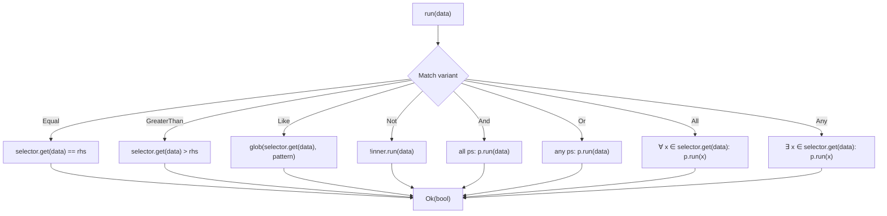

# Policy

Policy is a jq-inspired predicate language for constraining the arguments of UCAN invocations at delegation time.

## Overview

A policy is a list of predicates. Each predicate combines _what to check_ (a comparison operator) with _where to look_ (a selector path into IPLD data). The two layers compose:

```
┌─────────────────────────────────────────────┐
│ Predicate                                   │
│  "is the value at this path greater than 5?"│
│                                             │
│  ┌────────────┐   ┌──────────────────────┐  │
│  │  Operator  │ + │  Selector            │  │
│  │  ">"       │   │  ".foo.bar[0]"       │  │
│  └────────────┘   └──────────────────────┘  │
└─────────────────────────────────────────────┘
```

Predicates are serialized as IPLD arrays and evaluated against invocation arguments at runtime. A delegation's policy _must_ be at least as restrictive as its parent — the chain narrows authority monotonically.

## Predicate Enum

```rust
enum Predicate {
    Equal(Select<Ipld>, Ipld),
    GreaterThan(Select<Number>, Number),
    GreaterThanOrEqual(Select<Number>, Number),
    LessThan(Select<Number>, Number),
    LessThanOrEqual(Select<Number>, Number),
    Like(Select<String>, String),
    Not(Box<Predicate>),
    And(Vec<Predicate>),
    Or(Vec<Predicate>),
    All(Select<Collection>, Box<Predicate>),
    Any(Select<Collection>, Box<Predicate>),
}
```

Each variant carries a _typed_ selector (`Select<T>`) and a comparison value. The type parameter constrains what the selector is allowed to extract.

| Variant | Select Type | Comparison Type | Description |
|---------|-------------|-----------------|-------------|
| `Equal` | `Ipld` | `Ipld` | Structural equality |
| `GreaterThan` | `Number` | `Number` | Numeric `>` |
| `GreaterThanOrEqual` | `Number` | `Number` | Numeric `>=` |
| `LessThan` | `Number` | `Number` | Numeric `<` |
| `LessThanOrEqual` | `Number` | `Number` | Numeric `<=` |
| `Like` | `String` | `String` | Glob pattern match |
| `Not` | — | `Predicate` | Logical negation |
| `And` | — | `Vec<Predicate>` | Conjunction (all must hold) |
| `Or` | — | `Vec<Predicate>` | Disjunction (any must hold) |
| `All` | `Collection` | `Predicate` | Universal quantifier (∀) |
| `Any` | `Collection` | `Predicate` | Existential quantifier (∃) |

## Serialization Format

Predicates serialize as IPLD arrays (tuples). Comparison predicates use a 3-element form; logical connectives use a 2-element or 3-element form depending on arity.

### Comparison Predicates (3-Tuple)

```
[<operator>, <selector>, <value>]
```

| Operator | Serialized Tag | Example |
|----------|---------------|---------|
| `Equal` | `"=="` | `["==", ".from", "alice@example.com"]` |
| `GreaterThan` | `">"` | `[">", ".age", 18]` |
| `GreaterThanOrEqual` | `">="` | `[">=", ".balance", 0]` |
| `LessThan` | `"<"` | `["<", ".retries", 5]` |
| `LessThanOrEqual` | `"<="` | `["<=", ".priority", 10]` |
| `Like` | `"like"` | `["like", ".email", "*@example.com"]` |

### Logical Connectives (2-Tuple)

```
[<operator>, <inner>]
```

| Operator | Serialized Tag | Example |
|----------|---------------|---------|
| `Not` | `"not"` | `["not", ["==", ".x", 1]]` |
| `And` | `"and"` | `["and", [["==", ".x", 1], [">", ".y", 0]]]` |
| `Or` | `"or"` | `["or", [["==", ".x", 1], ["==", ".x", 2]]]` |

### Quantifiers (3-Tuple)

```
[<operator>, <collection-selector>, <predicate>]
```

| Operator | Serialized Tag | Example |
|----------|---------------|---------|
| `All` | `"all"` | `["all", ".items[]", ["<", ".", 100]]` |
| `Any` | `"any"` | `["any", ".tags[]", ["==", ".", "urgent"]]` |

### The `!=` Desugaring

The wire format accepts `"!="` as syntactic sugar. It deserializes to `Not(Equal(...))`:

```
["!=", ".status", "blocked"]
```

is equivalent to:

```
["not", ["==", ".status", "blocked"]]
```

There is no `NotEqual` variant in the `Predicate` enum. The `TryFrom<Ipld>` implementation handles this transformation during parsing.

## Selectors

Selectors are jq-inspired paths that navigate into IPLD data structures. A selector is a dot-prefixed string composed of filters.

### Selector Structure

```rust
struct Selector(Vec<Filter>);
```

All selectors start with `.` (the identity / root). Filters are applied left-to-right, progressively narrowing the focus.

```
.foo.bar[0]["special key"][]
│   │   │   │              └── Values (iterate collection)
│   │   │   └──────────────── Field (bracket syntax)
│   │   └──────────────────── ArrayIndex
│   └──────────────────────── Field (dot syntax)
└──────────────────────────── Root
```

### Filter Types

```rust
enum Filter {
    ArrayIndex(i32),
    Field(String),
    Values,
    Try(Box<Filter>),
}
```

| Filter | Syntax | Example | Description |
|--------|--------|---------|-------------|
| `Field` | `.key` or `["key"]` | `.foo`, `["with spaces"]` | Extract a map field by key |
| `ArrayIndex` | `[n]` | `[0]`, `[-1]` | Extract an array element by index |
| `Values` | `[]` | `.items[]` | Iterate all values in a collection |
| `Try` | `<filter>?` | `.foo?`, `[0]?` | Return `Null` instead of erroring on missing |

Dot-syntax fields must start with an alphabetic character or `_` and contain only alphanumerics and `_`. All other keys require bracket-quote syntax `["key"]`.

Negative indices count from the end of the array: `[-1]` selects the last element, `[-2]` the second-to-last.

> [!NOTE]
> The `Try` filter (`?`) is critical for optional-field checks. `["==", ".nickname?", null]` succeeds when the field is absent, while `["==", ".nickname", null]` returns a `SelectorError`.

### Selector Parsing

Selectors are parsed from strings via `nom` combinators. The grammar, simplified:

```
selector     = "." (dot_field | ε) filter*
filter       = try_filter | non_try_filter
try_filter   = non_try_filter "?"+
non_try_filter = values | field | array_index
values       = "[]"
field        = dot_field | delim_field
dot_field    = "." [a-zA-Z_][a-zA-Z0-9_]*
delim_field  = "[" json_string "]"
array_index  = "[" "-"? [0-9]+ "]"
```

Multiple trailing `?` characters collapse into a single `Try` wrapper.

## Select&lt;T: Selectable&gt;

`Select<T>` wraps a `Selector` with a phantom type parameter to enforce type-safe extraction:

```rust
struct Select<T> {
    filters: Vec<Filter>,
    _marker: PhantomData<T>,
}
```

The type parameter `T` must implement the `Selectable` trait, which defines how to convert the extracted `Ipld` node into the expected Rust type.

| `T` | Accepts | Rejects |
|-----|---------|---------|
| `Ipld` | Any IPLD value | _(nothing)_ |
| `Number` | `Ipld::Integer`, `Ipld::Float` | All other variants |
| `String` | `Ipld::String` | All other variants |
| `Collection` | `Ipld::List`, `Ipld::Map` | All other variants |

This design ensures that `Select<Number>` can only appear in numeric predicates (`>`, `>=`, `<`, `<=`), while `Select<Ipld>` is used for `==` where any type is valid.

```rust
trait Selectable: Sized {
    fn try_select(ipld: Ipld) -> Result<Self, SelectorErrorReason>;
}
```

## Evaluation

Calling `Predicate::run(self, data: &Ipld) -> Result<bool, RunError>` evaluates the predicate against concrete IPLD data.



### Empty Collection Semantics

| Variant | Empty collection | Rationale |
|---------|-----------------|-----------|
| `Or` | `true` | Vacuous truth (no failing disjunct) |
| `Any` | `true` | Vacuous truth (no element to falsify) |
| `And` | `true` | Vacuous truth (no failing conjunct) |
| `All` | `true` | Vacuous truth (no element to falsify) |

### Float/Integer Equality

When comparing `Ipld::Integer` with `Ipld::Float` via `==`, the float must be whole (no fractional part, not NaN, not infinite). If the float is non-whole, evaluation returns `RunError::CannotCompareNonwholeFloatToInt` rather than a boolean.

### Error Types

```rust
enum RunError {
    CannotCompareNonwholeFloatToInt,
    CannotCompareNaNs,
    SelectorError(SelectorError),
}
```

Evaluation errors are _not_ treated as `false`. A shape mismatch (e.g., indexing into a string) propagates as `Err`, distinct from a predicate that evaluates to `Ok(false)`.

## Glob Matching

The `like` operator uses a simple glob matcher. The only special character is `*`, which matches zero or more characters. Backslash-escaping (`\*`) matches a literal asterisk.

| Pattern | Input | Result |
|---------|-------|--------|
| `"hello world"` | `"hello world"` | `true` |
| `"*@example.com"` | `"alice@example.com"` | `true` |
| `"hello*"` | `"hello world"` | `true` |
| `"h*o*d"` | `"hello world"` | `true` |
| `"*"` | _(any string)_ | `true` |
| `""` | `"hello"` | `false` |
| `r"\*"` | `"*"` | `true` |

The implementation splits the pattern on unescaped `*` characters and checks that all fragments appear in order within the input string.

## Property Tests

Roundtrip properties are tested for both layers:

| Property | Scope |
|----------|-------|
| `Filter` display/parse roundtrip | `proptest` with `Arbitrary` |
| `Filter` DAG-CBOR encode/decode roundtrip | `proptest` with `serde_ipld_dagcbor` |
| `Select<Ipld>` identity (`.` returns input) | `proptest` with `Arbitrary` |
| `Select<Ipld>` try-missing returns `Null` | `proptest` with `Arbitrary` |

The `Arbitrary` instances for `Predicate`, `Select<T>`, and `Filter` are gated behind `#[cfg(any(test, feature = "test_utils"))]`.

## Source Layout

```
ucan/src/delegation/policy/
  predicate.rs       Predicate enum, serialization, run(), glob()
  selector.rs        Selector struct, parsing, Display, PartialOrd
  selector/
    filter.rs        Filter enum, nom parsers, Display, FromStr
    select.rs        Select<T> phantom-typed wrapper, get()
    selectable.rs    Selectable trait + impls for Ipld, Number, String, Collection
    error.rs         ParseError, SelectorError, SelectorErrorReason
```
