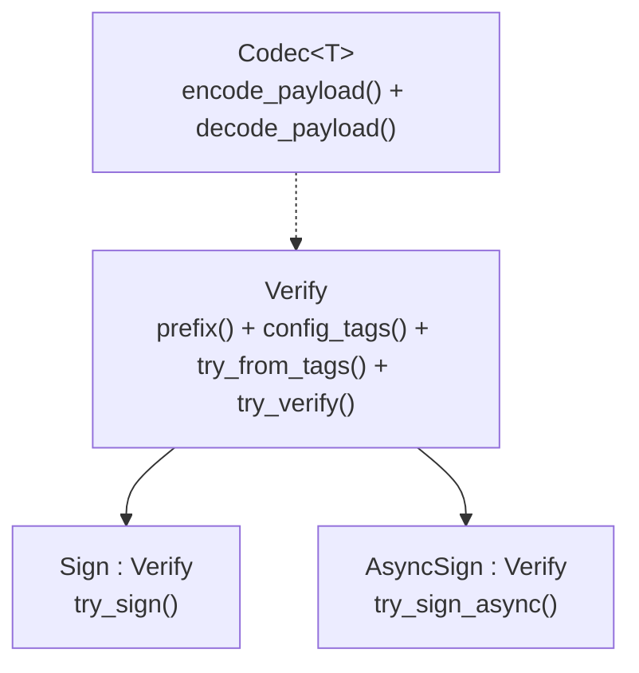
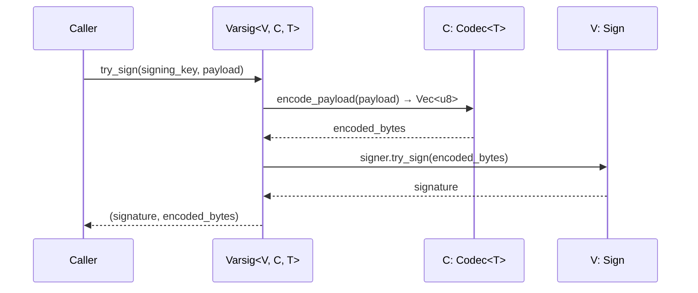
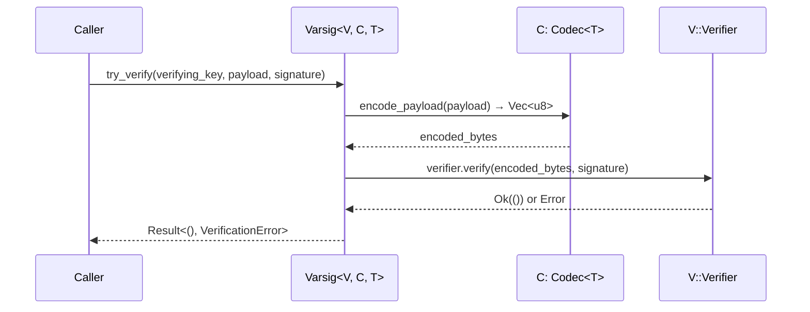

# Varsig

Varsig is a self-describing signature metadata header that encodes _which_ signature algorithm and _which_ codec were used, so that verifiers can reconstruct the signed payload without out-of-band configuration.

## Overview

A Varsig header is a sequence of LEB128-encoded multicodec tags:

```
┌────────┬─────────┬───────────┬──────────────┬───────┐
│ 0x34   │  0x01   │  prefix   │ config_tags  │ codec │
│ varsig │ version │ (algo)    │ (algo params)│       │
└────────┴─────────┴───────────┴──────────────┴───────┘
         all values are unsigned LEB128
```

For example, an Ed25519 signature with DAG-CBOR encoding serializes as:

```
0x34 0x01 0xED 0x01 0xED 0x01 0x13 0x71
│    │    │    │    │    │    │    └── DAG-CBOR codec (0x71)
│    │    │    │    │    │    └────── SHA-512 hash (0x13)
│    │    │    │    └────┘ ────────── Ed25519 curve tag
│    │    └────┘ ─────────────────── EdDSA prefix (0xED, 0x01)
│    └────────────────────────────── Version 1
└─────────────────────────────────── Varsig tag
```

## Type Structure

```rust
struct Varsig<V: Verify, C: Codec<T>, T> {
    verifier_cfg: V,  // e.g., EdDsa<Edwards25519, Sha2_512>
    codec: C,         // e.g., DagCborCodec
    _data: PhantomData<T>,
}
```

The three generic parameters form a complete description:

| Parameter | Role | Example |
|-----------|------|---------|
| `V` | Signature algorithm configuration | `Ed25519`, `Es256`, `WebCrypto` |
| `C` | Payload codec | `DagCborCodec`, `DagJsonCodec`, `Encoding` |
| `T` | Payload type (phantom) | `DelegationPayload<D>` |

## Trait Hierarchy



### `Verify`

The core trait for signature algorithms. Each implementation knows its multicodec tags and how to verify a signature.

```rust
trait Verify: Sized + Debug {
    type Signature: SignatureEncoding + Debug;
    type Verifier: Verifier<Self::Signature> + Debug;

    fn prefix(&self) -> u64;
    fn config_tags(&self) -> Vec<u64>;
    fn try_from_tags(bytes: &[u64]) -> Option<(Self, &[u64])>;
    fn try_verify<T, C: Codec<T>>(&self, codec: &C, verifier: &Self::Verifier,
                                    signature: &Self::Signature, payload: &T)
        -> Result<(), VerificationError<C::EncodingError>>;
}
```

### `Codec<T>`

Slice-based encoding/decoding for `no_std` compatibility.

```rust
trait Codec<T>: Sized {
    type EncodingError: Error;
    type DecodingError: Error;

    fn multicodec_code(&self) -> u64;
    fn try_from_tags(code: &[u64]) -> Option<Self>;
    fn encode_payload(&self, payload: &T) -> Result<Vec<u8>, Self::EncodingError>;
    fn decode_payload(&self, bytes: &[u8]) -> Result<T, Self::DecodingError>;
}
```

> [!NOTE]
> The `Codec` API uses `Vec<u8>` / `&[u8]` rather than `Write` / `BufRead` to support `no_std`. The `DagCborCodec` implementation delegates to `serde_ipld_dagcbor::to_vec` / `from_slice`.

## Supported Algorithms

| Type | Prefix | Config Tags | Feature |
|------|--------|-------------|---------|
| Ed25519 | `0xED` | `[0xED, 0x13]` | `ed25519` |
| ES256 (P-256) | `0xEC` | `[0x1201, 0x15]` | `es256` |
| ES384 (P-384) | `0xEC` | `[0x1202, 0x20]` | `es384` |
| ES512 (P-521) | `0xEC` | `[0x1202, 0x13]` | `es512` |
| ES256K (secp256k1) | `0xE7` | `[0xE7, 0x1201, 0x15]` | `es256k` |
| WebCrypto (composite) | varies | varies | `web_crypto` |

## Signing Flow



## Verification Flow



## `DagCborCodec` in `no_std`

The `DagCborCodec` type has two definitions depending on the `std` feature:

| Mode | Source | Multicodec Code |
|------|--------|-----------------|
| `std` | Re-exported from `serde_ipld_dagcbor::codec::DagCborCodec` | `0x71` |
| `no_std` | Local unit struct | `0x71` (hardcoded) |

The multicodec code `0x71` is a stable IANA constant. It is hardcoded rather than sourced from `ipld_core::codec::Codec` because that trait is gated behind `std` in `ipld-core`.
